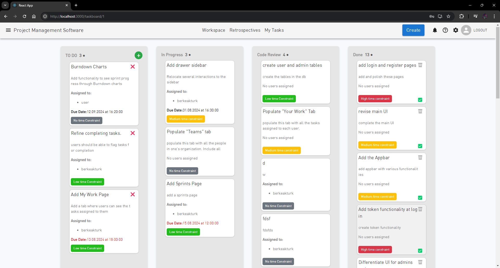
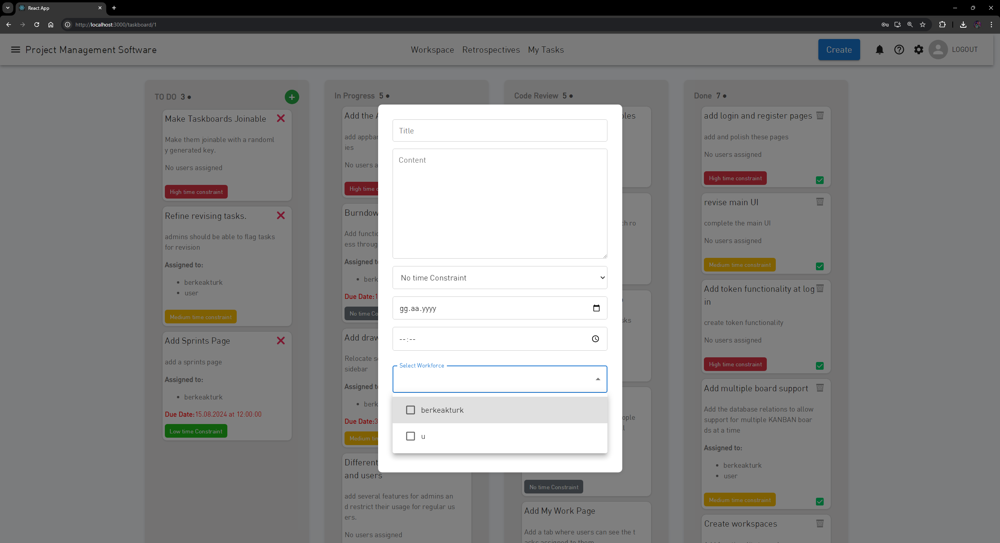
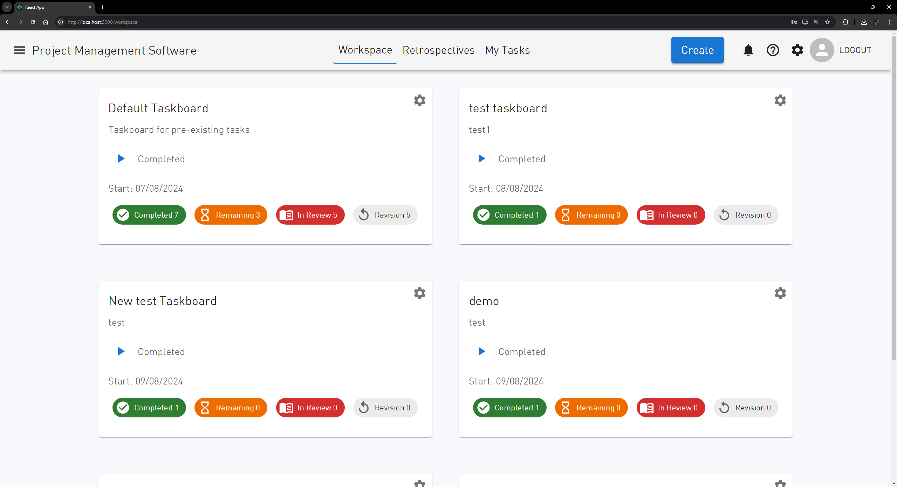
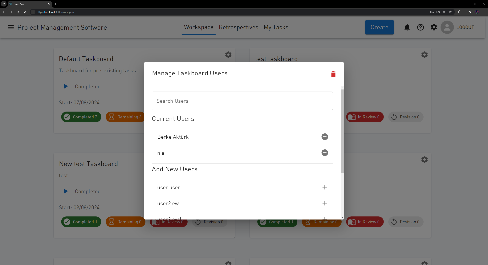
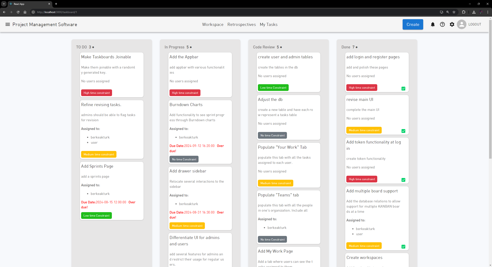

# Fullstack Web Application

This project is a full-stack web application designed for team and project management. It offers a variety of features to streamline collaboration and task management within teams:

- **Project Creation:** Easily create and manage projects.
- **Task Management:** Assign tasks to team members and track their progress.
- **Task Completion & Review:** Team members can complete tasks and submit them for review.
- **Admin Controls:** Admins can review tasks, request revisions, or confirm their completion.

The application consists of a React frontend and a Node.js backend, with PostgreSQL as the database. It is fully containerized using Docker and Docker Compose, ensuring a consistent and efficient development and deployment environment.


## Table of Contents

- [Getting Started](#getting-started)
  - [Prerequisites](#prerequisites)
  - [Installation](#installation)
  - [Running the Application](#running-the-application)
- [Technologies Used](#technologies-used)

## Getting Started

### Prerequisites

Make sure you have the following installed on your machine:

- [Docker](https://www.docker.com/get-started)
- [Docker Compose](https://docs.docker.com/compose/install/)

### Installation

1. **Clone the repository:**

   ```bash
   git clone https://github.com/your-username/fullstack-webapp.git
   cd fullstack-webapp

2. **Build and start the Docker Containers.**

    docker-compose up --build

## Running the Application

    Once the containers are up and running, you can access the application:

    -Frontend: Open your browser and navigate to http://localhost:3000
    -Backend: The backend API is available at http://localhost:3001

## Technologies Used

**Frontend:**
- React
- TypeScript
- Material-UI
- Jest & React Testing Library

**Backend:**
- Node.js
- Express.js
- Sequelize ORM
- PostgreSQL
- Jest & Supertest

**Other:**
- Docker
- Docker Compose

## Screenshots

Here are some screenshots of the application to illustrate its main features:

### 1. Project Dashboard


### 2. Task Management View


### 3. Workspace View



### 4. User Tasks View

